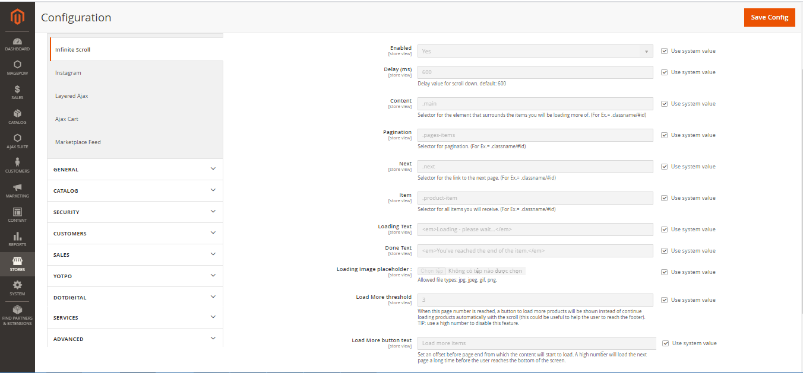
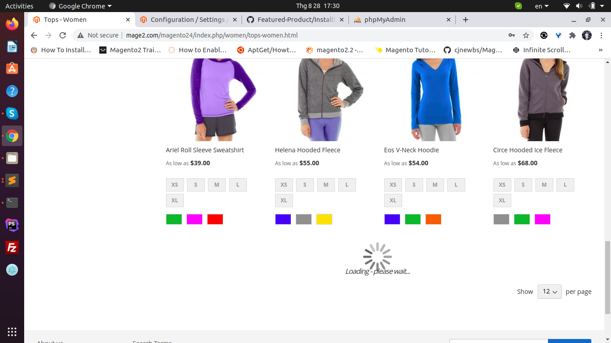

# M2Commerce: Magento 2 Infinite Ajax Scroll

## Description

**Infinite scroll** for Magento 2 automatically loads product catalog without reloading the page. Your customers will be pleasantly surprised with supportive navigation and high performance of your web store.

### Features

- Automatically load content and images in just one page.
- Visitors can see all in just one page
- Display load more chart to help users see more products.
- Reduce the request load to the server, increase website speed
- Increase professional animation effects for Magento website.
- Support to increase website ranking on search engines
- Responsive

### Configuration

In `Stores > Configuration > Commerce Enterprise > Infinite Ajax Scroll` we set:
* **Delay (ms)**: Delay time for the scroll down, default 600.
* **Content**: Select for the elements that surrounds the items you will be loading more of (For Ex. = .classname/#id).
* **Pagination**: Select class, id for paging loaded more.
* **Next**: Select class, id for the link to to the next page.
* **Item**: Select for the class name that you want to config all items you will load more.
* **Loading text**: Place any text you want when loading the page.
* **Done text**: When the download is completed, the text you configured will appear.
* **Loading Image placeholder**: The icons you want are displayed while downloading more, you can change it arbitrarily or use Magento's default icons.
* **Load More threshold**: When this page number is reached, a button to load more products will be shown instead of continue loading products automatically with the scroll.
* **Load More button text**: Configure the download button text.

### Screenshot




## Installation
### Magento® Marketplace

This extension will also be available on the Magento® Marketplace when approved.

1. Go to Magento® 2 root folder
2. Require/Download this extension:

   Enter following commands to install extension.

   ```
   composer require m2commerce/infinite-scroll"
   ```

   Wait while composer is updated.

   #### OR

   You can also download code from this repo under Magento® 2 following directory:

    ```
    app/code/M2Commerce/InfiniteScroll
    ```    

3. Enter following commands to enable the module:

   ```
   php bin/magento module:enable M2Commerce_InfiniteScroll
   php bin/magento setup:upgrade
   php bin/magento setup:di:compile
   php bin/magento cache:clean
   php bin/magento cache:flush
   ```

4. If Magento® is running in production mode, deploy static content:

   ```
   php bin/magento setup:static-content:deploy
   ```
